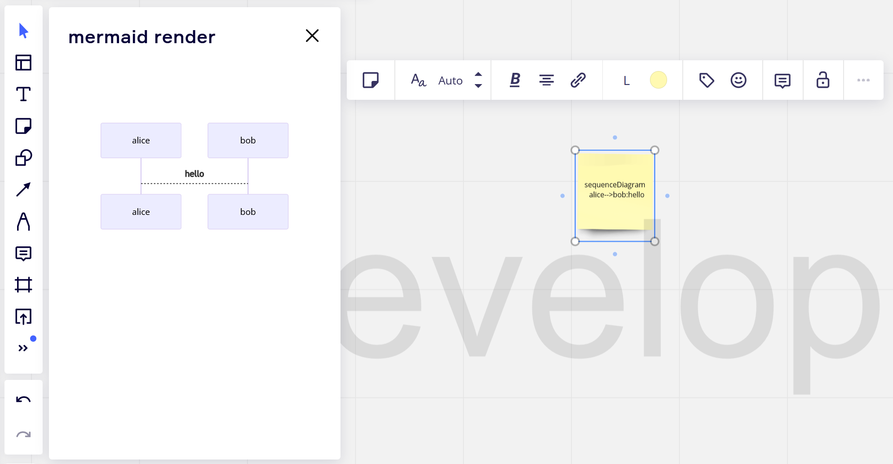

## Miro mermaid render

A minimal [Miro app](https://developers.miro.com/docs/build-your-first-hello-world-app) that renders the content of a selected text or sticky note widget into a [mermaid-js](https://mermaid-js.github.io/mermaid/#/) SVG in the app panel.



### How to start locally

-   Run `npm install` to install dependencies.
-   Run `npm start` to start developing. \
    Your URL should be similar to this example: \
    ```
    http://localhost:3000
    ```
-   Paste the URL under **App URL** in your
    [app settings](https://developers.miro.com/docs/build-your-first-hello-world-app#step-3-create-your-app-in-miro).
-   Open a board; you should see your app in the app toolbar or in the **Apps**
    panel.

### How to build the app

-   Run `npm run build`. \
    This generates a static output inside `dist/`, which you can host on a static hosting
    service.

### About the app

This app uses [Vite](https://vitejs.dev/). \
If you want to modify the `vite.config.js` configuration, see the [Vite documentation](https://vitejs.dev/guide/).
